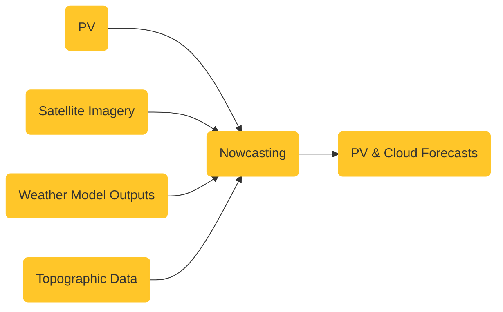

# Nowcasting Website

This is the marketing website for Nowcasting, hosted at [nowcasting.io](nowcasting.io).

## Getting Started

First, run the development server:

```bash
yarn install
yarn dev
```

Open [http://localhost:3000](http://localhost:3000) with your browser to see the result.

## Flowchart of the NOWCASTING data model


